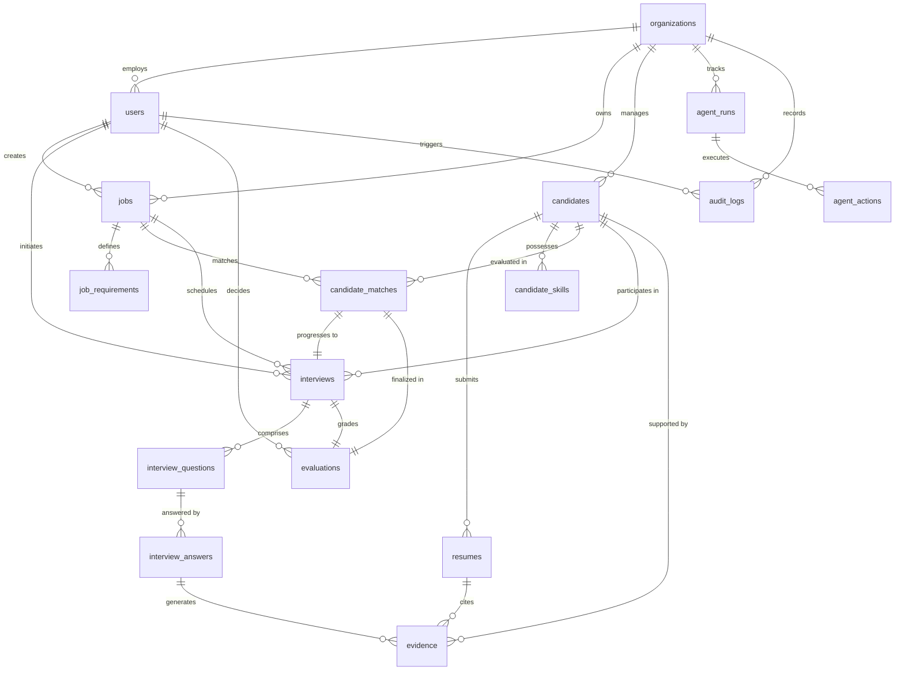

# HireFlow — Database Schema Specification (DATABASE_SCHEMA.md)

---

## 1. Schema Architecture & Design Principles

HireFlow uses a relational **PostgreSQL 15+** database with the **`pgvector`** extension for vector similarity search. The schema is designed for:
- **Strict Referential Integrity:** Foreign key constraints with cascade/set-null policies prevent orphaned data.
- **Relational Grounding & Provenance:** Every score, gap, evaluation, and question is tied back to specific source documents, interview transcripts, and audit logs.
- **Multi-Tenant Security:** Organization-level isolation (`org_id`) enforced across all primary tables via Supabase Row-Level Security (RLS).
- **Auditability:** Dedicated `audit_logs`, `agent_runs`, and `agent_actions` tables ensure compliance with NYC Local Law 144 and EU AI Act requirements.



---

## 2. Comprehensive Table Definitions

---

### 2.1 `organizations`
Represents customer organizations or hiring departments. Forms the root of multi-tenant isolation.

| Column | Type | PK | FK | Nullable | Default | Index | Description |
| :--- | :--- | :--- | :--- | :--- | :--- | :--- | :--- |
| `id` | `UUID` | YES | - | NO | `gen_random_uuid()` | B-Tree (PK) | Organization unique identifier |
| `name` | `VARCHAR(255)` | - | - | NO | - | - | Organization name |
| `slug` | `VARCHAR(100)` | - | - | NO | - | B-Tree (UNIQUE) | URL-friendly identifier |
| `created_at` | `TIMESTAMPTZ` | - | - | NO | `NOW()` | - | Record creation timestamp |
| `updated_at` | `TIMESTAMPTZ` | - | - | NO | `NOW()` | - | Last update timestamp |

---

### 2.2 `users`
Recruiters, hiring managers, and administrators interacting with HireFlow.

| Column | Type | PK | FK | Nullable | Default | Index | Description |
| :--- | :--- | :--- | :--- | :--- | :--- | :--- | :--- |
| `id` | `UUID` | YES | - | NO | `gen_random_uuid()` | B-Tree (PK) | User ID (maps to Supabase auth) |
| `org_id` | `UUID` | - | `organizations(id)` | NO | - | B-Tree | Tenant organization |
| `email` | `VARCHAR(255)` | - | - | NO | - | B-Tree (UNIQUE) | User corporate email |
| `full_name` | `VARCHAR(255)` | - | - | NO | - | - | Full display name |
| `role` | `VARCHAR(50)` | - | - | NO | `'recruiter'` | B-Tree | `recruiter`, `hiring_manager`, `admin`, `auditor` |
| `avatar_url` | `TEXT` | - | - | YES | `NULL` | - | Profile picture link |
| `preferences` | `JSONB` | - | - | NO | `'{}'::jsonb` | GIN | Recruiter preferences & standards |
| `created_at` | `TIMESTAMPTZ` | - | - | NO | `NOW()` | - | Creation timestamp |
| `updated_at` | `TIMESTAMPTZ` | - | - | NO | `NOW()` | - | Last modification timestamp |

---

### 2.3 `jobs`
Job requisitions opened by recruiters, containing parsed criteria and bias audit results.

| Column | Type | PK | FK | Nullable | Default | Index | Description |
| :--- | :--- | :--- | :--- | :--- | :--- | :--- | :--- |
| `id` | `UUID` | YES | - | NO | `gen_random_uuid()` | B-Tree (PK) | Job requisition unique identifier |
| `org_id` | `UUID` | - | `organizations(id)` | NO | - | B-Tree | Tenant organization |
| `created_by_user_id` | `UUID` | - | `users(id)` | NO | - | B-Tree | Authoring recruiter |
| `title` | `VARCHAR(255)` | - | - | NO | - | B-Tree | Job posting title |
| `department` | `VARCHAR(100)` | - | - | NO | - | B-Tree | Department (Engineering, Product) |
| `status` | `VARCHAR(50)` | - | - | NO | `'draft'` | B-Tree | `draft`, `active`, `paused`, `closed` |
| `raw_description` | `TEXT` | - | - | NO | - | - | Original recruiter JD text |
| `optimized_description`| `TEXT` | - | - | YES | `NULL` | - | AI-rewritten bias-neutral description |
| `parsed_criteria` | `JSONB` | - | - | NO | `'{}'::jsonb` | GIN | Structured roles, skills, experience limits |
| `bias_risk_score` | `FLOAT` | - | - | YES | `NULL` | - | 0–100 Unconscious Bias Risk Index |
| `bias_findings` | `JSONB` | - | - | YES | `'[]'::jsonb` | GIN | Flagged non-inclusive phrases & replacements |
| `embedding` | `vector(1536)`| - | - | YES | `NULL` | HNSW (Cosine) | Dense vector embedding of job requirements |
| `created_at` | `TIMESTAMPTZ` | - | - | NO | `NOW()` | B-Tree | Creation timestamp |
| `updated_at` | `TIMESTAMPTZ` | - | - | NO | `NOW()` | - | Last modification timestamp |

---

### 2.4 `candidates`
Canonical candidate profiles.

| Column | Type | PK | FK | Nullable | Default | Index | Description |
| :--- | :--- | :--- | :--- | :--- | :--- | :--- | :--- |
| `id` | `UUID` | YES | - | NO | `gen_random_uuid()` | B-Tree (PK) | Candidate unique identifier |
| `org_id` | `UUID` | - | `organizations(id)` | NO | - | B-Tree | Tenant organization |
| `full_name` | `VARCHAR(255)` | - | - | NO | - | B-Tree | Candidate legal / display name |
| `email` | `VARCHAR(255)` | - | - | NO | - | B-Tree | Candidate primary contact email |
| `phone` | `VARCHAR(50)` | - | - | YES | `NULL` | - | Candidate contact phone number |
| `location` | `VARCHAR(150)` | - | - | YES | `NULL` | - | Geographic location / city |
| `current_title` | `VARCHAR(150)` | - | - | YES | `NULL` | - | Most recent professional role |
| `current_company` | `VARCHAR(150)` | - | - | YES | `NULL` | - | Most recent employer |
| `years_of_experience`| `NUMERIC(4,1)`| - | - | YES | `NULL` | B-Tree | Total calculated years of work history |
| `linkedin_url` | `TEXT` | - | - | YES | `NULL` | - | Profile URL |
| `github_url` | `TEXT` | - | - | YES | `NULL` | - | Developer portfolio link |
| `portfolio_url` | `TEXT` | - | - | YES | `NULL` | - | Personal website / work link |
| `parsed_profile` | `JSONB` | - | - | NO | `'{}'::jsonb` | GIN | Normalized education, history, skills JSON |
| `created_at` | `TIMESTAMPTZ` | - | - | NO | `NOW()` | B-Tree | Profile ingestion timestamp |
| `updated_at` | `TIMESTAMPTZ` | - | - | NO | `NOW()` | - | Last update timestamp |

---

### 2.5 `resumes`
Uploaded resume documents and extracted text layers.

| Column | Type | PK | FK | Nullable | Default | Index | Description |
| :--- | :--- | :--- | :--- | :--- | :--- | :--- | :--- |
| `id` | `UUID` | YES | - | NO | `gen_random_uuid()` | B-Tree (PK) | Resume record identifier |
| `candidate_id` | `UUID` | - | `candidates(id)` | NO | - | B-Tree | Owning candidate (CASCADE delete) |
| `file_name` | `VARCHAR(255)` | - | - | NO | - | - | Original uploaded file name |
| `file_path` | `TEXT` | - | - | NO | - | - | Storage path (UUID-based on disk / S3) |
| `file_type` | `VARCHAR(50)` | - | - | NO | - | - | `application/pdf`, `docx`, `text/plain` |
| `file_size_bytes` | `BIGINT` | - | - | NO | - | - | Upload size in bytes (max 10MB) |
| `raw_text` | `TEXT` | - | - | NO | - | - | Raw extracted plain text |
| `parsing_status` | `VARCHAR(50)` | - | - | NO | `'pending'` | B-Tree | `pending`, `processing`, `completed`, `failed` |
| `parsing_error` | `TEXT` | - | - | YES | `NULL` | - | Error message if extraction failed |
| `embedding` | `vector(1536)`| - | - | YES | `NULL` | HNSW (Cosine) | Dense vector embedding of resume text |
| `created_at` | `TIMESTAMPTZ` | - | - | NO | `NOW()` | - | Upload timestamp |

---

### 2.6 `candidate_skills`
Normalized individual technical and domain skills extracted from candidate materials.

| Column | Type | PK | FK | Nullable | Default | Index | Description |
| :--- | :--- | :--- | :--- | :--- | :--- | :--- | :--- |
| `id` | `UUID` | YES | - | NO | `gen_random_uuid()` | B-Tree (PK) | Skill record identifier |
| `candidate_id` | `UUID` | - | `candidates(id)` | NO | - | B-Tree | Candidate owning this skill |
| `skill_name` | `VARCHAR(100)` | - | - | NO | - | B-Tree | Normalized name (`PostgreSQL`, `FastAPI`) |
| `category` | `VARCHAR(50)` | - | - | NO | `'technical'` | - | `technical`, `framework`, `tool`, `soft` |
| `years_experience` | `NUMERIC(4,1)`| - | - | YES | `NULL` | - | Calculated experience with this skill |
| `proficiency_level`| `VARCHAR(50)` | - | - | YES | `NULL` | - | `beginner`, `intermediate`, `advanced` |
| `verification_status`|`VARCHAR(50)`| - | - | NO | `'unverified'`| B-Tree | `unverified`, `verified_resume`, `verified_interview`, `challenged` |
| `created_at` | `TIMESTAMPTZ` | - | - | NO | `NOW()` | - | Skill extraction timestamp |

---

### 2.7 `job_requirements`
Atomic requirements extracted from a job description used for heuristic re-ranking.

| Column | Type | PK | FK | Nullable | Default | Index | Description |
| :--- | :--- | :--- | :--- | :--- | :--- | :--- | :--- |
| `id` | `UUID` | YES | - | NO | `gen_random_uuid()` | B-Tree (PK) | Requirement identifier |
| `job_id` | `UUID` | - | `jobs(id)` | NO | - | B-Tree | Parent job requisition |
| `requirement_text` | `TEXT` | - | - | NO | - | - | Requirement statement |
| `requirement_type` | `VARCHAR(50)` | - | - | NO | `'must_have'` | B-Tree | `must_have`, `nice_to_have`, `preferred` |
| `category` | `VARCHAR(50)` | - | - | NO | `'skill'` | - | `skill`, `experience`, `education`, `domain` |
| `weight` | `NUMERIC(3,2)`| - | - | NO | `1.00` | - | Mathematical weight in re-ranking (0.0–2.0) |
| `created_at` | `TIMESTAMPTZ` | - | - | NO | `NOW()` | - | Creation timestamp |

---

### 2.8 `candidate_matches`
Evaluated match between a specific candidate and job requisition.

| Column | Type | PK | FK | Nullable | Default | Index | Description |
| :--- | :--- | :--- | :--- | :--- | :--- | :--- | :--- |
| `id` | `UUID` | YES | - | NO | `gen_random_uuid()` | B-Tree (PK) | Match record identifier |
| `job_id` | `UUID` | - | `jobs(id)` | NO | - | B-Tree | Matched job requisition |
| `candidate_id` | `UUID` | - | `candidates(id)` | NO | - | B-Tree | Evaluated candidate |
| `overall_match_score`|`NUMERIC(5,2)`| - | - | NO | - | B-Tree | Weighted overall score (0.00–100.00) |
| `vector_similarity`| `NUMERIC(5,4)`| - | - | NO | - | - | Cosine similarity signal (0.0000–1.0000) |
| `skill_overlap_score`|`NUMERIC(5,2)`| - | - | NO | - | - | Hard skill overlap percentage (0–100) |
| `experience_fit_score`|`NUMERIC(5,2)`| - | - | NO | - | - | Experience proximity score (0–100) |
| `reasoning` | `TEXT` | - | - | NO | - | - | 2–3 sentence grounded justification |
| `matched_skills` | `JSONB` | - | - | NO | `'[]'::jsonb` | GIN | List of confirmed matched requirements |
| `missing_skills` | `JSONB` | - | - | NO | `'[]'::jsonb` | GIN | List of identified gaps |
| `pipeline_stage` | `VARCHAR(50)` | - | - | NO | `'matched'` | B-Tree | `matched`, `screening_prep`, `interview_active`, `evaluated`, `advanced`, `rejected` |
| `created_at` | `TIMESTAMPTZ` | - | - | NO | `NOW()` | B-Tree | Matching execution timestamp |
| `updated_at` | `TIMESTAMPTZ` | - | - | NO | `NOW()` | - | Last stage update |

---

### 2.9 `interviews`
Active or historical candidate screening interview sessions.

| Column | Type | PK | FK | Nullable | Default | Index | Description |
| :--- | :--- | :--- | :--- | :--- | :--- | :--- | :--- |
| `id` | `UUID` | YES | - | NO | `gen_random_uuid()` | B-Tree (PK) | Interview session identifier |
| `job_id` | `UUID` | - | `jobs(id)` | NO | - | B-Tree | Job requisition |
| `candidate_id` | `UUID` | - | `candidates(id)` | NO | - | B-Tree | Interviewed candidate |
| `match_id` | `UUID` | - | `candidate_matches(id)`| NO | - | B-Tree | Related match scorecard |
| `created_by_user_id`|`UUID` | - | `users(id)` | NO | - | - | Recruiter launching interview |
| `status` | `VARCHAR(50)` | - | - | NO | `'scheduled'` | B-Tree | `scheduled`, `in_progress`, `completed`, `cancelled`, `aborted` |
| `current_question_index`|`INT` | - | - | NO | `0` | - | Active question in state machine |
| `tamper_flag` | `BOOLEAN` | - | - | NO | `FALSE` | B-Tree | Set TRUE if prompt injection detected |
| `tamper_details` | `JSONB` | - | - | YES | `NULL` | - | Injection string & classifier reason |
| `started_at` | `TIMESTAMPTZ` | - | - | YES | `NULL` | - | Session start time |
| `completed_at` | `TIMESTAMPTZ` | - | - | YES | `NULL` | - | Session finish time |
| `created_at` | `TIMESTAMPTZ` | - | - | NO | `NOW()` | - | Creation timestamp |
| `updated_at` | `TIMESTAMPTZ` | - | - | NO | `NOW()` | - | Last modification timestamp |

---

### 2.10 `interview_questions`
Customized questions synthesized to target candidate gaps for a specific interview.

| Column | Type | PK | FK | Nullable | Default | Index | Description |
| :--- | :--- | :--- | :--- | :--- | :--- | :--- | :--- |
| `id` | `UUID` | YES | - | NO | `gen_random_uuid()` | B-Tree (PK) | Question identifier |
| `interview_id` | `UUID` | - | `interviews(id)`| NO | - | B-Tree | Parent interview session |
| `order_index` | `INT` | - | - | NO | - | B-Tree | Question order (1 to 5) |
| `category` | `VARCHAR(50)` | - | - | NO | - | B-Tree | `technical_depth`, `gap_probe`, `behavioral`, `culture_fit`, `situational` |
| `question_text` | `TEXT` | - | - | NO | - | - | Question wording |
| `intent` | `TEXT` | - | - | NO | - | - | Hiring intent behind question |
| `targeted_gap` | `TEXT` | - | - | YES | `NULL` | - | Specific gap this question probes |
| `rubric_criteria` | `JSONB` | - | - | NO | `'{}'::jsonb` | GIN | Pre-generated grading rubric criteria |
| `is_customized` | `BOOLEAN` | - | - | NO | `FALSE` | - | TRUE if edited by recruiter |
| `created_at` | `TIMESTAMPTZ` | - | - | NO | `NOW()` | - | Synthesis timestamp |

---

### 2.11 `interview_answers`
Candidate speech/text turns submitted during the screening session.

| Column | Type | PK | FK | Nullable | Default | Index | Description |
| :--- | :--- | :--- | :--- | :--- | :--- | :--- | :--- |
| `id` | `UUID` | YES | - | NO | `gen_random_uuid()` | B-Tree (PK) | Answer turn identifier |
| `question_id` | `UUID` | - | `interview_questions(id)`| NO | - | B-Tree | Question being answered |
| `interview_id` | `UUID` | - | `interviews(id)`| NO | - | B-Tree | Parent interview session |
| `transcript_text` | `TEXT` | - | - | NO | - | - | Transcribed candidate response |
| `attempt_number` | `INT` | - | - | NO | `1` | - | Turn attempt count (max 2) |
| `follow_up_prompt`| `TEXT` | - | - | YES | `NULL` | - | Clarification requested by AI agent |
| `audio_recording_url`|`TEXT`| - | - | YES | `NULL` | - | Audio recording snippet link (if voice) |
| `duration_seconds`| `INT` | - | - | YES | `NULL` | - | Response speech duration |
| `created_at` | `TIMESTAMPTZ` | - | - | NO | `NOW()` | - | Turn completion timestamp |

---

### 2.12 `evaluations`
Rubric-based evaluation report and final human decision gates.

| Column | Type | PK | FK | Nullable | Default | Index | Description |
| :--- | :--- | :--- | :--- | :--- | :--- | :--- | :--- |
| `id` | `UUID` | YES | - | NO | `gen_random_uuid()` | B-Tree (PK) | Evaluation identifier |
| `interview_id` | `UUID` | - | `interviews(id)`| NO | - | B-Tree (UNIQUE) | Evaluated interview session |
| `match_id` | `UUID` | - | `candidate_matches(id)`| NO | - | B-Tree | Associated match scorecard |
| `technical_score` | `NUMERIC(5,2)`| - | - | NO | - | - | Technical correctness score (0–100) |
| `communication_score`|`NUMERIC(5,2)`| - | - | NO | - | - | Communication clarity score (0–100) |
| `depth_score` | `NUMERIC(5,2)`| - | - | NO | - | - | Problem-solving depth score (0–100) |
| `overall_interview_score`|`NUMERIC(5,2)`| - | - | NO | - | B-Tree | Composite interview score (0–100) |
| `category_scores` | `JSONB` | - | - | NO | `'{}'::jsonb` | GIN | Scores per question category |
| `strengths` | `JSONB` | - | - | NO | `'[]'::jsonb` | - | Verified strengths discovered in interview |
| `weaknesses` | `JSONB` | - | - | NO | `'[]'::jsonb` | - | Unresolved gaps and weaknesses |
| `executive_summary`| `TEXT` | - | - | NO | - | - | Final multi-paragraph assessment |
| `ai_recommendation`| `VARCHAR(50)` | - | - | NO | - | B-Tree | `advance`, `review_needed`, `reject` |
| `human_decision` | `VARCHAR(50)` | - | - | YES | `NULL` | B-Tree | `advanced`, `rejected`, `follow_up` |
| `human_decision_notes`|`TEXT` | - | - | YES | `NULL` | - | Mandatory/optional human rationale |
| `human_decision_by_user_id`|`UUID`| - | `users(id)`| YES | `NULL` | - | Recruiter committing final decision |
| `human_decision_at`|`TIMESTAMPTZ`| - | - | YES | `NULL` | - | Decision timestamp |
| `created_at` | `TIMESTAMPTZ` | - | - | NO | `NOW()` | - | Evaluation creation timestamp |
| `updated_at` | `TIMESTAMPTZ` | - | - | NO | `NOW()` | - | Last update timestamp |

---

### 2.13 `evidence`
Traceable evidence linking claims to verbatim document or transcript excerpts.

| Column | Type | PK | FK | Nullable | Default | Index | Description |
| :--- | :--- | :--- | :--- | :--- | :--- | :--- | :--- |
| `id` | `UUID` | YES | - | NO | `gen_random_uuid()` | B-Tree (PK) | Evidence citation identifier |
| `candidate_id` | `UUID` | - | `candidates(id)` | NO | - | B-Tree | Candidate owning claim |
| `resume_id` | `UUID` | - | `resumes(id)` | YES | `NULL` | B-Tree | Source resume document (if resume) |
| `answer_id` | `UUID` | - | `interview_answers(id)`| YES | `NULL` | B-Tree | Source answer (if interview turn) |
| `claim_type` | `VARCHAR(50)` | - | - | NO | - | B-Tree | `skill`, `experience`, `certification` |
| `claim_text` | `TEXT` | - | - | NO | - | - | Assessed claim (`5 years Python`) |
| `verbatim_source_text`|`TEXT` | - | - | NO | - | - | Exact quote from document or transcript |
| `source_type` | `VARCHAR(50)` | - | - | NO | - | - | `resume`, `interview_transcript` |
| `confidence_score` | `NUMERIC(3,2)`| - | - | NO | `1.00` | - | Grounding confidence (0.0–1.0) |
| `is_overridden_by_human`|`BOOLEAN`| - | - | NO | `FALSE` | - | Set TRUE if recruiter disputed claim |
| `overridden_by_user_id`|`UUID` | - | `users(id)` | YES | `NULL` | - | Recruiter overriding evidence |
| `override_reason` | `TEXT` | - | - | YES | `NULL` | - | Explanation for override |
| `created_at` | `TIMESTAMPTZ` | - | - | NO | `NOW()` | - | Citation creation timestamp |

---

### 2.14 `agent_runs`
Tracks invocations of specialized AI agent pipelines.

| Column | Type | PK | FK | Nullable | Default | Index | Description |
| :--- | :--- | :--- | :--- | :--- | :--- | :--- | :--- |
| `id` | `UUID` | YES | - | NO | `gen_random_uuid()` | B-Tree (PK) | Agent run unique identifier |
| `org_id` | `UUID` | - | `organizations(id)` | NO | - | B-Tree | Tenant organization |
| `agent_name` | `VARCHAR(100)` | - | - | NO | - | B-Tree | `JDBiasAuditor`, `CandidateScorer`, etc. |
| `session_id` | `VARCHAR(100)` | - | - | YES | `NULL` | B-Tree | Client workflow session correlation ID |
| `status` | `VARCHAR(50)` | - | - | NO | `'running'` | B-Tree | `running`, `completed`, `failed`, `retried` |
| `input_payload_hash`|`VARCHAR(64)`| - | - | YES | `NULL` | - | SHA-256 hash of input data for dedup |
| `retry_count` | `INT` | - | - | NO | `0` | - | Self-healing repair retries attempted |
| `duration_ms` | `INT` | - | - | YES | `NULL` | - | End-to-end execution latency in ms |
| `created_at` | `TIMESTAMPTZ` | - | - | NO | `NOW()` | B-Tree | Run initiation timestamp |
| `completed_at` | `TIMESTAMPTZ` | - | - | YES | `NULL` | - | Run completion timestamp |

---

### 2.15 `agent_actions`
Granular record of individual LLM inference calls, tool executions, and tokens.

| Column | Type | PK | FK | Nullable | Default | Index | Description |
| :--- | :--- | :--- | :--- | :--- | :--- | :--- | :--- |
| `id` | `UUID` | YES | - | NO | `gen_random_uuid()` | B-Tree (PK) | Action record identifier |
| `agent_run_id` | `UUID` | - | `agent_runs(id)` | NO | - | B-Tree | Parent agent execution run |
| `action_type` | `VARCHAR(100)` | - | - | NO | - | B-Tree | `llm_completion`, `vector_search`, `repair` |
| `tool_name` | `VARCHAR(100)` | - | - | YES | `NULL` | - | Executed tool (e.g., `pdf_to_text`) |
| `prompt_tokens` | `INT` | - | - | NO | `0` | - | Input token count |
| `completion_tokens`|`INT` | - | - | NO | `0` | - | Generated token count |
| `latency_ms` | `INT` | - | - | NO | - | - | Step latency in milliseconds |
| `estimated_cost` | `NUMERIC(8,6)`| - | - | NO | `0.000000` | - | Cost in USD (e.g., `$0.000420`) |
| `status` | `VARCHAR(50)` | - | - | NO | - | B-Tree | `success`, `validation_error`, `timeout` |
| `error_message` | `TEXT` | - | - | YES | `NULL` | - | Error message if step failed |
| `created_at` | `TIMESTAMPTZ` | - | - | NO | `NOW()` | - | Action timestamp |

---

### 2.16 `audit_logs`
Immutable compliance and decision provenance log.

| Column | Type | PK | FK | Nullable | Default | Index | Description |
| :--- | :--- | :--- | :--- | :--- | :--- | :--- | :--- |
| `id` | `UUID` | YES | - | NO | `gen_random_uuid()` | B-Tree (PK) | Immutable audit event identifier |
| `org_id` | `UUID` | - | `organizations(id)` | NO | - | B-Tree | Tenant organization |
| `user_id` | `UUID` | - | `users(id)` | YES | `NULL` | B-Tree | Actor who triggered event |
| `event_type` | `VARCHAR(100)` | - | - | NO | - | B-Tree | `human_decision_recorded`, `score_overridden` |
| `target_entity_type`|`VARCHAR(50)`| - | - | NO | - | B-Tree | `job`, `candidate`, `match`, `interview` |
| `target_entity_id`| `UUID` | - | - | NO | - | B-Tree | ID of target entity |
| `actor_type` | `VARCHAR(50)` | - | - | NO | `'user'` | - | `user`, `ai_agent`, `system` |
| `action_summary` | `TEXT` | - | - | NO | - | - | Human-readable event description |
| `previous_state` | `JSONB` | - | - | YES | `NULL` | - | State prior to modification |
| `new_state` | `JSONB` | - | - | YES | `NULL` | - | State after modification |
| `ip_address` | `VARCHAR(45)` | - | - | YES | `NULL` | - | Client IP address |
| `user_agent` | `TEXT` | - | - | YES | `NULL` | - | Client browser / device user agent |
| `created_at` | `TIMESTAMPTZ` | - | - | NO | `NOW()` | B-Tree | Timestamp (strictly read-only) |

---

## 3. Relationships & Foreign Key Cascade Rules

```
[organizations]
 ├── (1:N) users                [ON DELETE RESTRICT]
 ├── (1:N) jobs                 [ON DELETE CASCADE]
 ├── (1:N) candidates           [ON DELETE CASCADE]
 ├── (1:N) agent_runs           [ON DELETE CASCADE]
 └── (1:N) audit_logs           [ON DELETE RESTRICT]

[users]
 ├── (1:N) jobs                 [ON DELETE RESTRICT]
 ├── (1:N) interviews           [ON DELETE RESTRICT]
 ├── (1:N) evaluations          [ON DELETE SET NULL]
 └── (1:N) evidence overrides   [ON DELETE SET NULL]

[jobs]
 ├── (1:N) job_requirements     [ON DELETE CASCADE]
 ├── (1:N) candidate_matches    [ON DELETE CASCADE]
 └── (1:N) interviews           [ON DELETE CASCADE]

[candidates]
 ├── (1:N) resumes              [ON DELETE CASCADE]
 ├── (1:N) candidate_skills     [ON DELETE CASCADE]
 ├── (1:N) candidate_matches    [ON DELETE CASCADE]
 ├── (1:N) interviews           [ON DELETE CASCADE]
 └── (1:N) evidence             [ON DELETE CASCADE]

[interviews]
 ├── (1:N) interview_questions  [ON DELETE CASCADE]
 ├── (1:N) interview_answers    [ON DELETE CASCADE]
 └── (1:1) evaluations          [ON DELETE CASCADE]

[agent_runs]
 └── (1:N) agent_actions        [ON DELETE CASCADE]
```

---

## 4. Supabase Row Level Security (RLS) Requirements

All tables have RLS enabled. Isolation is strictly partitioned by `org_id` derived from the authenticated JWT:

```sql
-- Helper function to extract org_id from JWT app_metadata
CREATE OR REPLACE FUNCTION auth.current_org_id()
RETURNS UUID AS $$
  SELECT NULLIF(current_setting('request.jwt.claims', true)::jsonb->'app_metadata'->>'org_id', '')::UUID;
$$ LANGUAGE SQL STABLE;

-- Helper function to extract user role
CREATE OR REPLACE FUNCTION auth.current_user_role()
RETURNS TEXT AS $$
  SELECT NULLIF(current_setting('request.jwt.claims', true)::jsonb->'app_metadata'->>'role', 'recruiter');
$$ LANGUAGE SQL STABLE;
```

### Table-Specific RLS Policies

```sql
-- 1. Enable RLS across all tables
ALTER TABLE organizations ENABLE ROW LEVEL SECURITY;
ALTER TABLE users ENABLE ROW LEVEL SECURITY;
ALTER TABLE jobs ENABLE ROW LEVEL SECURITY;
ALTER TABLE candidates ENABLE ROW LEVEL SECURITY;
ALTER TABLE resumes ENABLE ROW LEVEL SECURITY;
ALTER TABLE candidate_skills ENABLE ROW LEVEL SECURITY;
ALTER TABLE job_requirements ENABLE ROW LEVEL SECURITY;
ALTER TABLE candidate_matches ENABLE ROW LEVEL SECURITY;
ALTER TABLE interviews ENABLE ROW LEVEL SECURITY;
ALTER TABLE interview_questions ENABLE ROW LEVEL SECURITY;
ALTER TABLE interview_answers ENABLE ROW LEVEL SECURITY;
ALTER TABLE evaluations ENABLE ROW LEVEL SECURITY;
ALTER TABLE evidence ENABLE ROW LEVEL SECURITY;
ALTER TABLE agent_runs ENABLE ROW LEVEL SECURITY;
ALTER TABLE agent_actions ENABLE ROW LEVEL SECURITY;
ALTER TABLE audit_logs ENABLE ROW LEVEL SECURITY;

-- 2. Organizations: Users can only read their own organization
CREATE POLICY "org_tenant_isolation" ON organizations
  FOR ALL USING (id = auth.current_org_id());

-- 3. Jobs: Scoped by org_id; Recruiters & Hiring Managers have write; Auditors read-only
CREATE POLICY "jobs_org_isolation" ON jobs
  FOR ALL USING (org_id = auth.current_org_id());

-- 4. Candidates: Scoped by org_id
CREATE POLICY "candidates_org_isolation" ON candidates
  FOR ALL USING (org_id = auth.current_org_id());

-- 5. Resumes: Cascades through candidates org_id
CREATE POLICY "resumes_org_isolation" ON resumes
  FOR ALL USING (
    EXISTS (
      SELECT 1 FROM candidates 
      WHERE candidates.id = resumes.candidate_id 
        AND candidates.org_id = auth.current_org_id()
    )
  );

-- 6. Candidate Matches: Scoped through jobs org_id
CREATE POLICY "matches_org_isolation" ON candidate_matches
  FOR ALL USING (
    EXISTS (
      SELECT 1 FROM jobs 
      WHERE jobs.id = candidate_matches.job_id 
        AND jobs.org_id = auth.current_org_id()
    )
  );

-- 7. Interviews & Evaluations: Scoped through jobs org_id
CREATE POLICY "interviews_org_isolation" ON interviews
  FOR ALL USING (
    EXISTS (
      SELECT 1 FROM jobs 
      WHERE jobs.id = interviews.job_id 
        AND jobs.org_id = auth.current_org_id()
    )
  );

CREATE POLICY "evaluations_org_isolation" ON evaluations
  FOR ALL USING (
    EXISTS (
      SELECT 1 FROM interviews 
      JOIN jobs ON jobs.id = interviews.job_id
      WHERE interviews.id = evaluations.interview_id 
        AND jobs.org_id = auth.current_org_id()
    )
  );

-- 8. Audit Logs: Strictly SELECT only for users; INSERT permitted; UPDATE/DELETE blocked for all
CREATE POLICY "audit_logs_read_only" ON audit_logs
  FOR SELECT USING (org_id = auth.current_org_id());

CREATE POLICY "audit_logs_insert_only" ON audit_logs
  FOR INSERT WITH CHECK (org_id = auth.current_org_id());

-- 9. Service Role Bypass for AI Agents / Background Workers
-- The background worker connects with the SUPABASE_SERVICE_ROLE_KEY which automatically bypasses RLS
```

---

## Summary Approval
This Database Schema Specification locks the data storage contract, entity relationships, indexing strategy, and security policies for **HireFlow**. All subsequent backend migrations (Alembic) and database models (SQLAlchemy) must strictly implement the tables, types, and RLS rules specified in this document.
