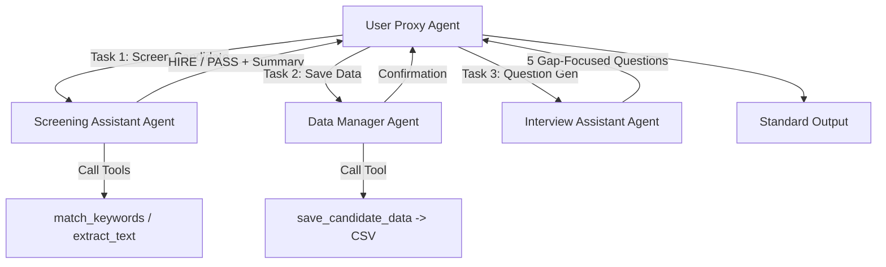
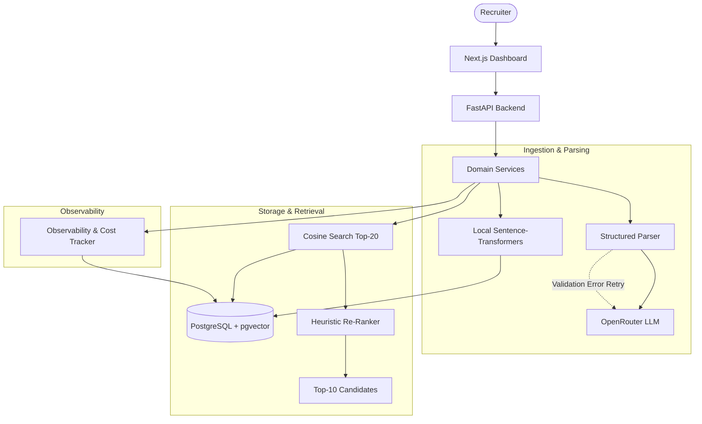
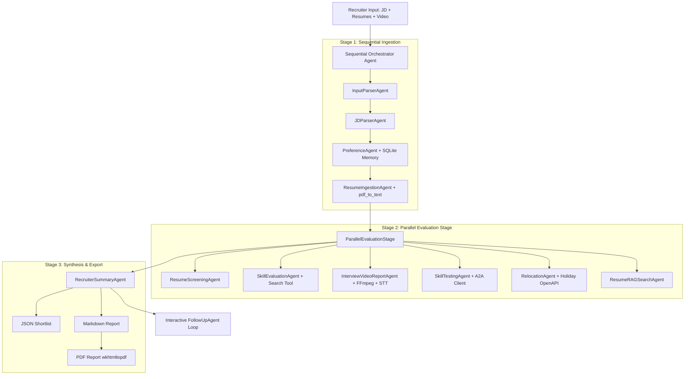
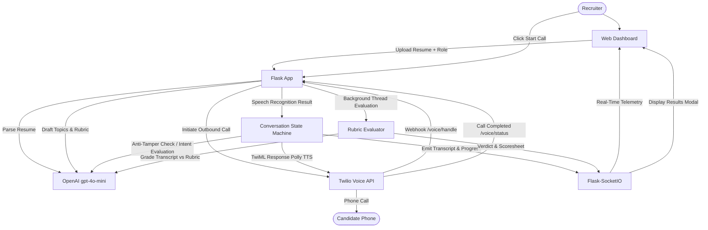
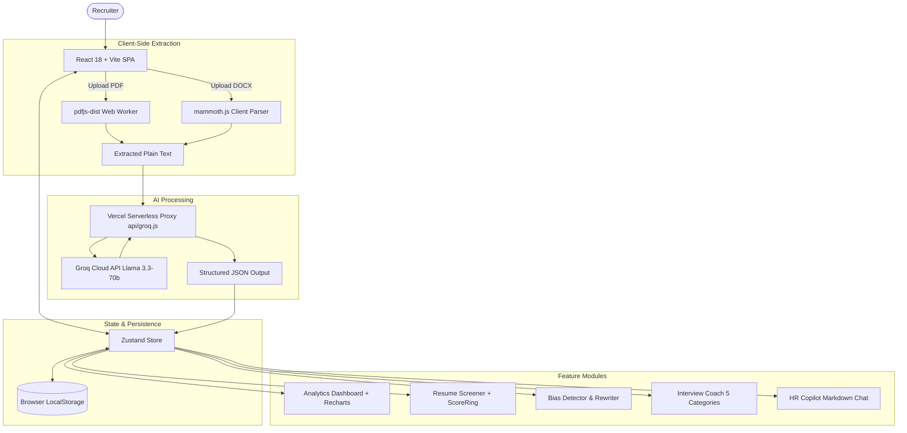

# Reference Repository Analysis

This document provides a comprehensive technical analysis of the five reference repositories located in `/references`. These repositories serve as **read-only architectural and design reference material** for the development of **HireFlow**.

> **Important Compliance Notice:**  
> The reference codebases are strictly read-only. None of their source code, exact prompts, proprietary assets, branding, or UI implementations are to be directly copied or reproduced.

---

## 1. recruitment-agent (`/references/recruitment-agent`)

### Purpose
A Python-based recruitment screening and interview preparation assistant leveraging the Microsoft AutoGen framework (classic v0.2). It automates resume screening against job descriptions, extracts candidate contact metadata, stores records in a CSV spreadsheet, and generates targeted follow-up interview questions based on identified skill gaps.

### Main Features
- **Document Parsing:** Extracts text from PDF (`pdfplumber`) and DOCX (`docx2txt`) resumes.
- **Deterministic & LLM Screening:** Combines natural language processing keyword matching with LLM evaluation to decide between a `HIRE` or `PASS` recommendation.
- **Candidate Data Management:** Extracts full name, email, and phone number, appending candidate records and screening verdicts to a local CSV file.
- **Gap-Driven Interview Questioning:** Analyzes screening summaries to generate 5 targeted interview questions specifically addressing candidate skill gaps.

### Architecture
- **Framework:** Microsoft AutoGen multi-agent conversational framework.
- **Execution Model:** Synchronous, CLI-based multi-turn conversation orchestrated through a `UserProxyAgent`.
- **Model:** OpenAI `gpt-4o-mini` with native function-calling capabilities.
- **NLP / Parsing Layer:** `spaCy` (`en_core_web_sm`) for tokenization, lemmatization, and stop-word filtering; `pdfplumber` and `docx2txt` for document reading.
- **Storage:** File-based flat CSV storage (`assets/candidate_data.csv`).

### Agent Structure
1. **User Proxy Agent (`user_proxy`):**
   - Type: `UserProxyAgent` (`human_input_mode="NEVER"`).
   - Role: System orchestrator and tool execution runtime. Initiates chats, provides context from previous agent turns, and executes tool calls made by the assistant agents.
2. **Screening Assistant (`screening_assistant`):**
   - Type: `AssistantAgent`.
   - Role: Evaluates candidate experience and skills against the job description using `match_keywords` and text extraction tools. Produces a `HIRE` or `PASS` verdict.
3. **Data Management Assistant (`data_manager`):**
   - Type: `AssistantAgent`.
   - Role: Extracts structured contact fields (name, email, phone) from the raw resume text and screening summary, then calls `save_candidate_data`.
4. **Interview Assistant (`interview_assistant`):**
   - Type: `AssistantAgent`.
   - Role: Ingests the screening conversation summary, identifies missing or weak competencies, and formulates 5 tailored interview questions.

### Tool Usage
- `extract_text_from_pdf`: Reads PDF binary via `pdfplumber`.
- `extract_text_from_docx`: Reads Word files via `docx2txt`.
- `read_text_from_file`: Reads plain text files (e.g., job descriptions).
- `match_keywords`: Uses `spaCy` NLP pipeline to extract nouns and proper nouns from both resume and job description, computing overlapping keyword sets.
- `save_candidate_data`: Formats candidate metadata into a dictionary and appends a row to `assets/candidate_data.csv`.

### Data Flow
1. Recruiter places target resume (`CV-English.pdf`) and job description (`job_description.txt`) into the `assets/` directory.
2. `app.py` initializes AutoGen agents and registers tool functions with `user_proxy` as executor.
3. `user_proxy` initiates conversation with `screening_assistant`, passing the file paths.
4. `screening_assistant` requests tool execution for text extraction and keyword matching, reasons about candidate fit, emits `HIRE` or `PASS`, and signals `TERMINATE`.
5. `user_proxy` takes the screening summary and invokes `data_manager`, which calls `save_candidate_data` to write candidate information to CSV.
6. `user_proxy` invokes `interview_assistant` with the screening summary to produce 5 gap-focused interview questions.
7. Final summaries are printed to the terminal console.

### UI Patterns
- **None:** Pure command-line interface. Interaction and outputs are logged strictly to stdout and saved to CSV.

### Useful Ideas for HireFlow
- **Skill-Gap Focused Interview Preparation:** Generating interview questions explicitly tied to the exact skill or experience deficiencies discovered during screening, rather than generic interview question banks.
- **Role Specialization:** Decoupling screening analysis from data extraction/persistence and question generation across distinct agent roles.
- **Hybrid Matching:** Pairing deterministic text matching (keyword/token overlap) with semantic LLM evaluation.

### Things We Should NOT Copy
- Brittle AutoGen v0.2 conversational loops relying on textual `'TERMINATE'` strings in prompt completions.
- Hardcoded local file paths and reliance on flat CSV files without relational structure, schema validation, or concurrent access control.
- Script-based single-candidate synchronous execution without API endpoints or background task processing.

### Relevant Limitations
- No web interface, REST API, or streaming UI feedback.
- Susceptible to infinite loops or premature termination if the LLM fails to output exact termination keywords.
- Zero support for batch processing or multi-candidate ranking.
- Basic spaCy keyword matching lacks semantic awareness (e.g., treats synonyms as non-matches).

---

## 2. recruitment-copilot (`/references/recruitment-copilot`)

### Purpose
A full-stack, production-grade AI recruitment platform providing end-to-end candidate screening, schema-validated structured CV and JD extraction with an automated self-healing repair loop, two-stage semantic search (pgvector retrieval + heuristic re-ranking), transparent fit scoring, interview question generation, and comprehensive LLM call observability and cost tracking.

### Main Features
- **Multi-Format Ingestion:** Ingests resumes and job descriptions via raw text, PDF, TXT, or Markdown uploads.
- **Structured Parsing with Repair Loop:** Transforms unstructured documents into validated Pydantic models, automatically passing validation errors back to the model if invalid JSON is produced (up to 3 retries).
- **Two-Stage Hybrid Search (RAG):** Cosine vector retrieval using `pgvector` to find top 20 candidates, followed by deterministic heuristic re-ranking (combining vector similarity, required skill overlap, and experience fit) to return the top 10.
- **Transparent Fit Scoring:** Generates explainable scores (0–100) with written reasoning, explicit matched skills, and missing skills.
- **Tailored Interview Question Generation:** Synthesizes structured questions per candidate-job pair.
- **Full LLM Observability:** Audits every inference call with token usage (prompt and completion), latency, success/failure status, and purpose categorization.
- **Isolated Testing Harness:** Dedicated test database and eval harness evaluating scoring accuracy against labeled pairs.

### Architecture
- **Frontend:** Next.js 16 (App Router), React, TypeScript, Tailwind CSS, shadcn/ui, Lucide React.
- **Backend:** FastAPI (Python 3.11+), Uvicorn, SQLAlchemy ORM, Alembic migrations, Pydantic v2.
- **Database & Vectors:** PostgreSQL with the `pgvector` extension for storing candidate/job relational records and high-dimensional embeddings.
- **Embeddings:** Local `sentence-transformers` (`all-MiniLM-L6-v2`) generating 384-dimensional dense vectors locally without external API latency or costs.
- **AI Provider:** OpenRouter API interfacing low-cost / open-weight models.
- **Infrastructure:** Docker Compose orchestrating database, backend, and frontend containers.

### Agent Structure
Rather than relying on conversational chat agent abstractions, this codebase adopts a **modular service-oriented architecture**:
- **`cv_parser` & `jd_parser`:** Specialized extraction services prompting the LLM for strict JSON conforming to `CandidateParsed` and `JobParsed` Pydantic schemas.
- **`scorer`:** Specialized evaluation service executing `score_fit()` with grounded instructions to output scores, reasoning, and skill overlap.
- **`interview_questions`:** Service dedicated to generating targeted questions for candidate-job pairings.
- **`cost_tracker` / `llm_client`:** Interceptor layer logging token consumption, execution latency, and error states.

### Tool Usage
- **Pydantic v2:** Runtime schema validation and automatic error serialization for the self-repair loop.
- **`pypdf`:** Server-side PDF text extraction.
- **`sentence-transformers`:** Local CPU-based embedding generation.
- **SQLAlchemy + pgvector:** Database-level cosine distance queries (`Candidate.embedding.cosine_distance(job.embedding)`).

### Data Flow
1. Recruiter submits candidate CV or job posting through the Next.js UI.
2. FastAPI endpoint passes raw text or uploaded document to `file_extraction`.
3. `parse_structured()` prompts the LLM for JSON adhering to the Pydantic schema.
4. If parsing fails or fields are missing, the validation error message is injected into a retry prompt (up to 3 attempts).
5. Structured entity is passed to `embeddings.py`, generating a vector representation.
6. The entity, parsed JSON, and vector embedding are committed to PostgreSQL.
7. For matching, `search_candidates_for_job()` performs a `pgvector` cosine query (Stage 1: Top 20).
8. Heuristic re-ranking computes weighted scores: `0.5 * vector_sim + 0.3 * skill_overlap + 0.2 * exp_fit` (Stage 2: Top 10).
9. Every LLM interaction writes an audit log to PostgreSQL recording token usage, latency, and status.

### UI Patterns
- Clean recruiter dashboard built with shadcn/ui components.
- Side-by-side search results display with similarity score bars, skill match badges, and experience comparisons.
- Candidate scoring modal providing transparent explanations (reasoning, matched tags, missing tags).
- Dedicated Observability dashboard showing call counts, token usage, latency distribution, and purpose breakdowns.

### Useful Ideas for HireFlow
- **Self-Healing LLM Output Repair Loop:** Feeding Pydantic validation errors directly back to the LLM to fix malformed outputs, drastically reducing structured parsing failures.
- **Two-Stage Search Pipeline:** Combining scalable vector search for broad semantic similarity with structured heuristic re-ranking (hard skills + experience depth) to eliminate false semantic positives.
- **Grounded Transparent Scoring:** Requiring the evaluation agent to output explicit evidence, matched criteria, and missing criteria alongside a numerical score.
- **Built-In Observability & Cost Tracking:** Logging every AI interaction with model, latency, tokens, cost, and purpose for auditable system transparency.

### Things We Should NOT Copy
- Verbatim Next.js frontend code, CSS classes, or shadcn component configurations.
- Fixed hardcoded re-ranking weights (`0.5, 0.3, 0.2`) without empirical validation or user configurability.
- Synchronous LLM execution within HTTP request handlers for heavy operations (risks connection timeouts).
- Specific OpenRouter free-tier workarounds.

### Relevant Limitations
- Absence of asynchronous job queues (e.g., Celery or BullMQ); requests block while waiting for LLM completions.
- Lacks autonomous multi-agent negotiation, planning, or conversational interactions.
- Heuristic re-ranking uses simple string matching for skills, which can miss nuanced synonyms without a skill ontology.

---

## 3. agent-hiresense (`/references/agent-hiresense`)

### Purpose
An enterprise-grade multi-agent recruitment platform built on the Google Agent Development Kit (ADK) and Gemini 2.5. It orchestrates a complex pipeline of sequential, parallel, and conversational loop agents equipped with tool calling, video/audio interview analysis (via FFmpeg and Google Cloud Speech-to-Text), persistent recruiter memory (SQLite), OpenAPI tools (Nager.Date), and external Agent-to-Agent (A2A) protocol integration.

### Main Features
- **Hierarchical Multi-Agent Pipeline:** Combines sequential preprocessing, concurrent multi-dimensional candidate evaluation, and automated report synthesis.
- **Interview Video Intelligence:** Extracts audio tracks from candidate MP4 videos using FFmpeg, generates speech transcripts using Google Cloud Speech-to-Text, and evaluates communication skills, confidence, clarity, and behavioral attributes using Gemini.
- **Persistent Recruiter Memory:** Employs SQLite to preserve recruiter preferences (target skills, minimum experience, domain priorities, past hiring decisions) across evaluation sessions.
- **Live Fact-Checking via Search:** Equips evaluation agents with web search capabilities to verify technical frameworks, certifications, or niche skills.
- **Relocation & Onboarding Intelligence:** Leverages OpenAPI tools (Nager.Date public holiday API) to suggest optimal joining windows and notice period schedules.
- **A2A Protocol Support:** Interfaces with remote skill-testing agent microservices using the Agent-to-Agent protocol.
- **Multi-Format Reporting:** Emits structured ATS JSON shortlists, comprehensive Markdown summaries, and styled PDF exports (`wkhtmltopdf`).
- **Interactive Follow-Up Q&A:** Features an interactive loop agent allowing recruiters to interrogate candidate reports post-pipeline.

### Architecture
- **Framework:** Google ADK (`LlmAgent`, `SequentialAgent`, `ParallelAgent`, `AgentTool`).
- **Models:** Google Gemini 2.5 suite (Gemini 2.5 Pro for complex evaluation, Gemini 2.5 Flash for lightweight parsing).
- **Audio/Video Processing:** Local FFmpeg binary for audio stream extraction; Google Cloud Speech-to-Text API for cloud transcription.
- **Memory & Storage:** SQLite for persistent recruiter preferences and session context; local filesystem for ATS JSON shortlists and PDF reports.
- **External APIs:** Google Vertex AI, Google Cloud Speech-to-Text, Nager.Date REST API.

### Agent Structure
1. **`InputParserAgent`:** Parses raw input into structured JSON containing recruiter ID, JD text, resume paths, and video paths.
2. **`JDParserAgent`:** Extracts structured requirements (role title, required skills, location, job type, experience level).
3. **`PreferenceAgent`:** Calls `recruiter_preferences_tool` to fetch recruiter historical preferences from SQLite and merges them into the evaluation criteria.
4. **`ResumeIngestionAgent`:** Invokes `pdf_to_text` across all uploaded resume paths.
5. **`ParallelEvaluationStage` (`ParallelAgent`):**
   - **`ResumeScreeningAgent`:** Scores resumes 0–100 and applies a minimum threshold filter.
   - **`SkillEvaluationAgent`:** Analyzes technical strengths and gaps, deploying a nested `SearchSubAgent` to verify unfamiliar technologies.
   - **`InterviewVideoReportAgent`:** Coordinates FFmpeg audio extraction and Google Cloud STT, synthesizing communication and confidence assessments.
   - **`SkillTestingAgent`:** Queries external A2A remote skill assessment endpoints.
   - **`RelocationAgent`:** Calls Nager.Date holiday tools to evaluate relocation schedules and joining windows.
   - **`ResumeRAGSearchAgent`:** Synthesizes structured resume bullet-point highlights.
6. **`RecruiterSummaryAgent`:** Aggregates outputs from all parallel agents, persists the final shortlist via `save_shortlist`, and writes the final report.
7. **`FollowUpAgent`:** Conversational loop agent answering recruiter queries over the aggregated evaluation context.

### Tool Usage
- `pdf_to_text`: Text extraction via `pdfminer`.
- `extract_audio`: Invokes local FFmpeg subprocess to extract 16kHz mono WAV from video.
- `transcribe_audio`: Google Cloud Speech-to-Text client submitting audio for recognition.
- `recruiter_preferences_tool`: Queries persistent SQLite memory for recruiter-specific preferences.
- `NAGER_DATE_TOOLS`: OpenAPI-based HTTP calls querying national public holidays.
- `AgentTool`: Wraps sub-agents (e.g., `SearchSubAgent`) as callable tools within parent agents.
- `save_shortlist`: Serializes the candidate shortlist to disk in JSON format.

### Data Flow
1. Recruiter provides job requirements, resume documents, and optional candidate video recordings.
2. The sequential root agent triggers input parsing, JD structuring, recruiter memory retrieval, and resume text extraction.
3. Ingested data is handed off to the `ParallelEvaluationStage`, where 6 specialized agents execute concurrently.
4. Each parallel agent runs domain-specific tools (FFmpeg, STT, Google Search, SQLite, OpenAPI).
5. Results from all parallel streams converge into the `RecruiterSummaryAgent`.
6. The summary agent writes the ATS JSON shortlist, Markdown dossier, and triggers PDF compilation.
7. The interactive CLI enters a read-eval-print loop with `FollowUpAgent` for conversational recruiter inquiries.

### UI Patterns
- Rich terminal console output (colored status banners, execution trees, and formatted tables).
- Static artifact generation: Formatted Markdown reports in `reports_md/`, compiled PDF reports in `reports/`, and JSON files in `ats/shortlists/`.

### Useful Ideas for HireFlow
- **Hierarchical Agent Composition:** Structuring recruitment workflows into sequential phases for setup/ingestion, parallel phases for multi-faceted evaluations, and aggregation phases for final synthesis.
- **Multimodal Evaluation:** Extracting and analyzing candidate interview audio/video transcripts for soft skills, communication clarity, and technical articulation.
- **Persistent Memory for Recruiter Preferences:** Remembering recruiter hiring preferences, standards, and team-specific requirements across sessions.
- **External Knowledge Verification:** Allowing the agent to verify candidate claims or emerging technical tools using web search tools.

### Things We Should NOT Copy
- Heavy platform lock-in to Google Cloud Vertex AI and Google Cloud Speech-to-Text credentials.
- Rigid dependency on external local native system binaries (`ffmpeg`, `wkhtmltopdf`).
- CLI-only execution without a modern web application interface.
- Direct filesystem file path coupling instead of multi-tenant object storage or database-backed assets.

### Relevant Limitations
- Setup complexity: requires GCP service account authentication, Cloud Speech API configuration, and native binary installations.
- No real-time web dashboard or interactive UI; output is strictly terminal- and file-based.
- Susceptible to long execution latency when processing long video files synchronously.

---

## 4. hirelens (`/references/hirelens`)

### Purpose
An autonomous AI phone interviewer platform capable of conducting real-time telephonic candidate screening over Twilio Programmable Voice. It parses resumes, dynamically generates tailored interview roadmaps and scoring rubrics, executes phone interviews with speech recognition and barge-in handling, enforces anti-tampering guardrails, and produces rubric-based candidate evaluations.

### Main Features
- **Resume Ingestion:** Parses candidate PDF resumes using `PyPDF2` and LLM extraction to capture contact info (phone, email) and career history.
- **Dynamic Interview Planning:** Synthesizes a 4–5 topic interview roadmap tailored to the candidate's background and target role.
- **Objective Rubric Pre-Generation:** Automatically drafts a detailed scoring rubric (correctness, communication, enthusiasm, professionalism, job fit) prior to the call.
- **Outbound Telephonic Screening:** Initiates real-time phone calls to candidates using Twilio Programmable Voice and Amazon Polly Neural TTS (`Polly.Joanna-Neural`).
- **Conversational State Machine:** Controls call progression across stages (`VERIFY_NAME`, `CHECK_READINESS`, `INTERVIEW`) with support for rescheduling.
- **Anti-Tampering & Anti-Jailbreak Protection:** Detects prompt injection, hacking attempts, or inappropriate responses, terminating calls immediately with an integrity violation flag.
- **Dynamic Follow-Ups & Skip Logic:** Follows up on vague answers (up to 2 attempts), accommodates skips/passes, and recovers gracefully from silences.
- **Real-Time Recruiter Telemetry:** Streams live speech transcripts, call status, and question progress to the recruiter web dashboard via WebSockets (`Flask-SocketIO`).
- **Post-Call Rubric Evaluation:** Grades the complete transcript against the pre-generated rubric in a background thread, computing category breakdowns and an Accept/Reject verdict.

### Architecture
- **Backend:** Python, Flask, Flask-SocketIO (threading mode).
- **Telephony & Speech:** Twilio Programmable Voice (TwiML webhooks, `<Gather input="speech">`, AWS Polly Neural TTS).
- **AI Engine:** OpenAI API (`gpt-4o-mini`) using JSON mode and prompt-guided completion.
- **Networking:** Local Ngrok tunneling exposing Flask endpoints to Twilio webhooks.
- **Session State:** In-memory dictionary (`SESSIONS`) indexed by UUID session tokens.

### Agent Structure
The platform implements 5 specialized logical agent roles coordinated through the Flask application lifecycle:
1. **Resume Intelligence Agent:** Extracts structured contact and work history strings from PDF text.
2. **Interview Planning Agent:** Generates custom interview questions and topics based on role requirements and resume claims.
3. **Evaluation Rubric Agent:** Formulates a tailored scoring rubric before the interview begins.
4. **Voice Interview Controller (State Machine Agent):** Governs conversational turn-taking, barge-in logic, identity verification, readiness checks, silence recovery, and anti-tamper enforcement during the call.
5. **Post-Interview Scoring Agent:** Runs asynchronously after call completion, mapping candidate answers against the rubric to yield itemized scores, strengths, weaknesses, and a final verdict.

### Tool Usage
- **Twilio TwiML:** `<VoiceResponse>`, `<Gather input="speech" bargeIn="true">`, `<Say voice="Polly.Joanna-Neural">`, `<Hangup>`, `<Redirect>`.
- **Twilio Python SDK:** Initiates outbound calls via `twilio_client.calls.create()`.
- **`PyPDF2`:** PDF document reading.
- **`Flask-SocketIO`:** Real-time event broadcasting (`transcript`, `progress`, `call_status`, `result`).

### Data Flow
1. Recruiter uploads candidate PDF resume and specifies the target role.
2. Flask extracts text, prompts LLM for structured profile data, and generates a session ID.
3. Recruiter reviews AI-generated interview topics and approves the scoring rubric.
4. Recruiter initiates call; Flask triggers Twilio outbound telephony.
5. Twilio connects to candidate and requests initial TwiML greeting from `/voice/intro`.
6. Candidate answers; Twilio streams speech-to-text results to `/voice/handle`.
7. Controller prompts LLM to classify user response, check for tampering, and generate next speech prompt.
8. Real-time transcripts and progress indicators are pushed to the recruiter dashboard over WebSockets.
9. Upon call completion, `/voice/status` spawns a background thread that submits the full transcript to the LLM for rubric grading.
10. Final evaluation results and hiring verdict are emitted via WebSocket to the UI.

### UI Patterns
- Guided multi-step workflow: Upload -> Review Topics -> Review Scoresheet -> Initiate Call.
- Live interview monitoring station: Real-time scrolling transcript feed with speaker differentiation, call status indicator, and dynamic question progress bar.
- Post-call evaluation modal displaying overall verdict badge (Accept / Reject / Callback), total score, key strengths, weaknesses, and per-question score breakdown.

### Useful Ideas for HireFlow
- **Autonomous Candidate Screening Interviews:** Automating initial candidate phone/voice screening with conversational AI.
- **Anti-Tampering Guardrails:** Proactive detection of prompt injection, conversational manipulation, or bad-faith behavior during automated interviews.
- **Pre-Generated Tailored Rubrics:** Creating an explicit, customized grading rubric before an interview occurs, ensuring transparent and objective post-interview scoring.
- **Live Interview Telemetry:** Real-time streaming of candidate-agent conversations and interview progress to recruiter dashboards.
- **Adaptive Turn-Taking:** Handling interruptions, vagueness (prompting for elaboration up to a set limit), and silence recovery.

### Things We Should NOT Copy
- Storing session and interview state in an ephemeral in-memory Python dictionary (`SESSIONS = {}`).
- Monolithic architecture packing routing, telephony, LLM prompting, and evaluation into a single 665-line file (`app.py`).
- Tight coupling to Ngrok local tunneling and direct PSTN telephony without fallback web-audio alternatives.
- Hardcoded decision ratios (e.g., fixed `> 0.6` ratio for Accept).

### Relevant Limitations
- Zero persistence: restarting the server wipes all active and historical interview sessions.
- Telephony latency: synchronous LLM completions during voice turns can introduce conversational delays.
- Telephony and carrier costs associated with outbound voice calling.
- Lacks candidate scheduling workflows (outside of a basic text reschedule prompt).

---

## 5. talentai-ui (`/references/talentai-ui`)

### Purpose
A modern, responsive AI-powered talent intelligence web application providing an automated resume screener, job description bias detector, tailored interview coach, context-aware HR copilot, and recruitment analytics dashboard, designed with a high-polish glassmorphism/claymorphism aesthetic.

### Main Features
- **Client-Side Document Parsing:** Parses PDF files (using Mozilla `pdfjs-dist` with Web Workers) and DOCX files (using `mammoth.js`) directly within the browser, eliminating server document processing overhead.
- **Resume Screener:** Uploads resumes and generates fit scores (0–100), Hire/Maybe/Pass recommendations, confidence ratings, candidate summaries, key strengths, and potential gaps.
- **Job Description Bias Detector:** Analyzes job postings for unconscious bias (gendered terms, ageism, exclusionary jargon like "ninja" or "rockstar"), scores bias risk (Low, Moderate, High), highlights problematic phrases with inclusive alternatives, and generates an AI-rewritten job opening.
- **Categorized Interview Coach:** Generates 5 categorized interview questions per candidate: Technical (blue), Behavioral (green), Gap Probe (red), Culture Fit (yellow), and Situational (pink), providing rationale/intent and clipboard copy actions.
- **Context-Aware HR Copilot:** A conversational assistant with access to all candidates screened in the current session, enabling recruiters to compare profiles, draft rejection/offer letters, and summarize recruitment batches.
- **Recruitment Analytics Dashboard:** Displays operational metrics (total screened, top candidates, average score, hours saved) and dynamic score distribution charts (`Recharts`).
- **Multi-Theme Visual Styling:** Provides Dark, Light, and Cyber aesthetic modes managed via Zustand and CSS custom properties.
- **Serverless API Proxy:** Uses a Vercel serverless function (`api/groq.js`) to protect API keys from client exposure.

### Architecture
- **Frontend Core:** React 18, Vite 5, JavaScript.
- **State Management:** Zustand 4 with `persist` middleware storing state in browser `localStorage`.
- **Styling & Animation:** Tailwind CSS v3, custom CSS variables, Framer Motion v10 for page and component micro-interactions.
- **Visualization & Typography:** Recharts for analytics; Lucide React for vector icons; Google Fonts (`Syne` for display headers, `DM Sans` for body copy).
- **AI Engine:** Groq Cloud API executing Meta `Llama-3.3-70b-versatile` with low inference latency and JSON response formatting.
- **Proxy Layer:** Vercel serverless functions handling `/api/groq/chat/completions`.

### Agent Structure
The system uses specialized prompt-driven AI functional engines:
- **Resume Screening Engine:** Prompts Llama 3.3 for structured JSON evaluations containing score, verdict, strengths, and weaknesses.
- **Bias Detection Engine:** Inspects job posting text for exclusionary language, generating a bias score, flagged words, and a rewritten opening.
- **Interview Coach Engine:** Formulates role- and candidate-specific questions partitioned across 5 distinct interview categories.
- **HR Copilot Engine:** Context-aware chat agent whose prompt incorporates the entire serialized array of active candidate records from the Zustand store.

### Tool Usage
- `pdfjs-dist`: Browser web worker for background PDF text extraction.
- `mammoth.js`: Browser-based Word document text extraction.
- `Recharts`: Responsive SVG charting components (`BarChart`, `ResponsiveContainer`, `Tooltip`).
- `ReactMarkdown`: Markdown rendering within the HR Copilot interface.
- Groq Cloud API with `response_format: { type: "json_object" }` and `temperature: 0.1`.

### Data Flow
1. Recruiter uploads a resume file (PDF, DOCX, TXT) into the browser.
2. Web workers extract raw text on the client without uploading binary files to a server.
3. Client dispatches the text and prompt to the serverless proxy (`api/groq.js`).
4. Proxy validates authorization and forwards the request to Groq (Llama 3.3-70b).
5. Groq returns structured JSON data within hundreds of milliseconds.
6. The client deserializes the response and saves the candidate record into the Zustand store.
7. Zustand updates browser `localStorage` and triggers reactive re-renders across the Dashboard, Candidates list, Interview Coach, and HR Copilot.

### UI Patterns
- Glassmorphism / claymorphism aesthetics with glowing borders and dark mode backgrounds.
- Animated circular score ring component (`ScoreRing.jsx`).
- Dynamic color-coded tag badges for categories and statuses (`TagBadge.jsx`).
- Fluid page transitions and spring hover animations via Framer Motion.
- Split-screen screener layout (file upload and input parameters on left; animated scores, strengths, and gap cards on right).
- Contextual chat interface with suggested quick-prompt chips and markdown formatting.

### Useful Ideas for HireFlow
- **Job Description Bias Detection & Inclusive Rewriting:** Evaluating JDs for unconscious bias, ageism, or non-inclusive terminology, providing automated neutral rewrites to broaden candidate pools.
- **Categorized Question Strategy:** Classifying interview questions into clear domains (Technical, Behavioral, Gap Probe, Culture Fit, Situational) with stated interviewer intent.
- **Holistic Pipeline Copilot:** An intelligent assistant equipped with full context over the active candidate pool for cross-candidate comparisons, email drafting, and pipeline synthesis.
- **High-Impact Visual Metrics:** Clean analytics cards (average score, top candidates count, distribution charts) giving recruiters immediate status overviews.
- **Client-Side Document Parsing Option:** Fast, client-side extraction for immediate user previews and zero-server document handling.

### Things We Should NOT Copy
- Relying exclusively on browser `localStorage` as the primary data store (unsuitable for multi-user, persistent enterprise workflows).
- Client-only architectural design for core business processes.
- Exact Tailwind utility classes, styling tokens, or visual themes.
- Re-injecting the entire candidate database into prompt context on every chat message (does not scale to large candidate pools).

### Relevant Limitations
- Absence of backend database: clearing browser storage permanently erases all candidate and job data.
- No multi-user collaboration or role-based access controls.
- Context-window overflow risk in the HR Copilot when candidate pools exceed LLM context bounds.
- No vector database or semantic embedding search.

---

## Cross-Repository Architectural Comparison

| Dimension | recruitment-agent | recruitment-copilot | agent-hiresense | hirelens | talentai-ui |
| :--- | :--- | :--- | :--- | :--- | :--- |
| **Primary Domain** | CLI Resume Screening | Full-Stack Recruiter Copilot | Enterprise Agent Platform | Autonomous Voice Interviewer | Talent Intelligence UI |
| **Agent Framework** | AutoGen (v0.2) | Service-Oriented (FastAPI) | Google ADK (Gemini 2.5) | Flask State Machine | React Client / Groq API |
| **Primary LLMs** | GPT-4o-mini | OpenRouter (Multi-model) | Gemini 2.5 Pro & Flash | GPT-4o-mini | Llama 3.3-70b (Groq) |
| **Frontend** | None (CLI) | Next.js 16 + Tailwind | Rich Terminal / PDF | Flask + Vanilla JS | React 18 + Vite + Tailwind |
| **Backend** | Python script | FastAPI + SQLAlchemy | Python pipeline | Flask + Flask-SocketIO | Vercel Serverless Proxy |
| **Data Persistence** | Local CSV | PostgreSQL + pgvector | SQLite + Local JSON | In-memory Python Dict | Browser LocalStorage |
| **Search / Matching** | spaCy token matching | pgvector + Heuristic Re-Rank | Parallel Screening Agent | LLM Prompt Evaluation | LLM Prompt Evaluation |
| **Multimodal / Voice**| None | None (Planned) | FFmpeg + Cloud STT | Twilio Voice + AWS Polly | None |
| **Key Architectural Strength** | Simple role separation | Reliable repair loop & observability | Complex hierarchical orchestration | Real-time voice state machine & guardrails | Fast client parsing & UI design |
| **Key Architectural Limitation** | Brittle chat loops, no UI | Synchronous HTTP handlers | Heavy GCP & binary dependencies | In-memory only, no DB | No backend DB, localStorage only |

