# HireFlow Reference Mapping Document

This document maps the architectural patterns, capabilities, and design ideas discovered across the five reference repositories into the conceptual subsystems of **HireFlow**.

> **Important Compliance Notice:**  
> The reference repositories are strictly read-only reference material. This document maps conceptual ideas, architectural designs, and functional inspirations **without copying source code, prompts, exact visual implementations, or proprietary configurations.**

---

## 1. High-Level Subsystem Mapping Matrix

| Reference Repository | Primary Area of Inspiration for HireFlow | Specific Subsystem / Capability |
| :--- | :--- | :--- |
| **`recruitment-agent`** | **Interview Gap Probing & Agent Specialization** | - Formulating follow-up interview questions driven strictly by gaps detected during initial screening. - Decoupling candidate evaluation from data persistence and question generation across distinct agent roles. |
| **`recruitment-copilot`** | **Reliability, Search & Observability Layer** | - Pydantic-driven self-healing repair-retry loop for robust structured LLM JSON extraction. - Two-stage candidate matching: broad vector similarity retrieval (`pgvector`) followed by structured heuristic re-ranking (skills + experience). - Grounded scoring transparency (score + reasoning + matched skills + missing skills). - Centralized LLM telemetry, latency tracking, token usage, and cost auditing. |
| **`agent-hiresense`** | **Hierarchical Agent Orchestration & Multimodal Analysis** | - Hybrid workflow architecture: sequential preprocessing stages paired with concurrent multi-agent evaluation stages. - Multimodal candidate evaluation (transcribing and analyzing interview audio/video for communication and clarity). - Persistent recruiter memory across sessions to adapt to recruiter-specific hiring preferences. - External tool verification (web search) to fact-check niche technical skills and frameworks. |
| **`hirelens`** | **Autonomous Screening & Anti-Tamper Guardrails** | - Autonomous screening interview workflows with dynamic turn-taking, barge-in support, and silence handling. - Pre-generating customized scoring rubrics prior to interview execution for objective grading. - Robust anti-tampering and prompt-injection guardrails for automated candidate interactions. - Real-time interview streaming (transcripts and progress indicators) to the recruiter dashboard. |
| **`talentai-ui`** | **Talent Intelligence UX, Bias Detection & Copilot** | - Pre-screening job description bias detection and inclusive rewriting. - Categorized interview question taxonomy (Technical, Behavioral, Gap Probe, Culture Fit, Situational) with hiring rationale. - Context-aware recruiter copilot capable of querying the active candidate pipeline. - Clean talent analytics dashboard design with visual score distribution charts and immediate KPI metrics. |

---

## 2. Detailed Mapping by HireFlow Functional Area

```mermaid
flowchart TD
    subgraph Ingestion & Inclusivity
        M_Ingest[Document Ingestion & Parsing]
        M_Bias[Job Bias Detection & Optimization]
    end

    subgraph Intelligence & Matching
        M_Search[Vector Retrieval & Re-ranking]
        M_Scoring[Transparent Scoring & Gap Analysis]
        M_Orch[Hierarchical Agent Orchestration]
    end

    subgraph Candidate Interaction
        M_Interview[Autonomous Screening & Voice Agent]
        M_Guard[Anti-Tamper & Security Guardrails]
    end

    subgraph Recruiter Experience & Governance
        M_UI[Analytics Dashboard & Candidate Matrix]
        M_Copilot[Context-Aware HR Copilot]
        M_Obs[Observability, Cost Tracking & Memory]
    end

    RC[recruitment-copilot] --> M_Ingest
    RC --> M_Search
    RC --> M_Scoring
    RC --> M_Obs

    TA[talentai-ui] --> M_Bias
    TA --> M_UI
    TA --> M_Copilot

    AHS[agent-hiresense] --> M_Orch
    AHS --> M_Obs
    AHS --> M_Interview

    HL[hirelens] --> M_Interview
    HL --> M_Guard
    HL --> M_Scoring

    RA[recruitment-agent] --> M_Scoring
    RA --> M_Interview
```

---

### Area A: Document Ingestion & Structured Parsing

#### Inspired By:
- **`recruitment-copilot`**: Schema-validated Pydantic extraction with an automated validation-error retry loop (`parse_structured`).
- **`talentai-ui`**: Client-side document parsing options (`pdfjs-dist` worker, `mammoth.js`) for instant candidate preview without server upload lag.
- **`agent-hiresense`**: Standardized text extraction tools decoupled from agent reasoning.

#### Relevance to HireFlow:
- **HireFlow Ingestion Pipeline:** Unstructured resumes (PDF, DOCX, TXT) and job descriptions must be ingested reliably into strict domain schemas without parsing failures or hallucinated fields.
- **Implementation Inspiration for HireFlow:**
  - Build a self-healing parsing loop: when an LLM produces malformed JSON or omits mandatory fields, automatically feed the exact schema validation error back to the model (up to 3 attempts).
  - Support multi-format inputs with deterministic extraction tools.

---

### Area B: Job Description Optimization & Bias Elimination

#### Inspired By:
- **`talentai-ui`**: Dedicated Bias Detector analyzing job descriptions for exclusionary language, masculine-coded jargon, ageism, and providing inclusive alternatives alongside an AI-rewritten opening.

#### Relevance to HireFlow:
- **HireFlow Bias & Quality Audit Subsystem:** Before candidates are matched or screened against a job opening, the job description itself should be evaluated for clarity, fairness, and inclusivity.
- **Implementation Inspiration for HireFlow:**
  - Create a proactive bias detection agent that inspects job postings for unconscious bias, extreme requirements, or exclusionary terminology.
  - Provide recruiters with an explainable bias risk score and single-click inclusive phrasing alternatives to maximize diverse talent attraction.

---

### Area C: Candidate-Job Matching & Two-Stage Search

#### Inspired By:
- **`recruitment-copilot`**: Two-stage retrieval pattern (pgvector cosine search for Top-K candidate pool + heuristic re-ranking incorporating vector similarity, required skill overlap, and experience fit).
- **`recruitment-agent`**: NLP-based keyword tokenization and lemmatization.

#### Relevance to HireFlow:
- **HireFlow Matching Engine:** Semantic embeddings alone frequently produce false matches (e.g., a candidate with a similar background but lacking a non-negotiable certification or language).
- **Implementation Inspiration for HireFlow:**
  - Adopt a **two-stage matching pipeline**:
    1. *Stage 1 (Broad Retrieval):* Fast vector similarity search across candidate embeddings to isolate the most relevant candidate subset.
    2. *Stage 2 (Precision Re-Ranking):* Grounded re-ranking assessing hard skill match percentage, years of experience proximity, and domain alignment.

---

### Area D: Transparent Evaluation, Fit Scoring & Gap Analysis

#### Inspired By:
- **`recruitment-copilot`**: Grounded scoring breakdown providing an overall score (0–100), transparent multi-sentence reasoning, explicit list of matched skills, and explicit list of missing skills.
- **`recruitment-agent`**: Identifying specific skill and experience gaps to guide downstream steps.
- **`hirelens`**: Pre-generating an objective scoring rubric before evaluating candidate performance.

#### Relevance to HireFlow:
- **HireFlow Candidate Evaluation Engine:** AI evaluations must never be black boxes. Recruiters and hiring managers require transparent, auditable evidence for why a candidate received a particular rating.
- **Implementation Inspiration for HireFlow:**
  - Ensure every evaluation produces a transparent scorecard: numerical match score, clear qualitative justification, explicit matched qualifications, and highlighted gap areas.
  - Automatically derive candidate-specific skill gaps to feed directly into personalized interview question roadmaps.

---

### Area E: Multi-Agent Orchestration & Workflow Architecture

#### Inspired By:
- **`agent-hiresense`**: Hierarchical composition utilizing sequential stages for preparatory tasks (parsing, preference loading) and parallel stages for independent evaluation tasks (technical screening, audio analysis, verification).
- **`recruitment-agent`**: Functional decomposition separating screening, record keeping, and interview preparation.

#### Relevance to HireFlow:
- **HireFlow Core Agent Orchestrator:** Real-world recruitment workflows involve multiple distinct steps: ingestion, preference check, multiple specialized evaluations, and synthesis.
- **Implementation Inspiration for HireFlow:**
  - Structure HireFlow’s workflow logically:
    - *Preparation Phase (Sequential):* Parse job, parse candidate, load recruiter standards.
    - *Evaluation Phase (Parallel):* Run resume fit assessment, skill verification, and gap detection concurrently to minimize latency.
    - *Synthesis Phase (Consolidation):* Aggregate outputs into a comprehensive candidate profile, interview plan, and executive summary.

---

### Area F: Automated Candidate Screening & Voice Interviewing

#### Inspired By:
- **`hirelens`**: Telephony/voice interview state machine with speech recognition, barge-in support, silence recovery, and turn-by-turn question delivery.
- **`hirelens`**: Dedicated anti-tamper and prompt-injection detection to catch adversarial or bad-faith candidate inputs.
- **`agent-hiresense`**: Multimodal evaluation extracting and transcribing interview audio/video to evaluate soft skills, communication clarity, and confidence.
- **`recruitment-agent`**: Focusing interview questions on the candidate's exact resume weaknesses.
- **`talentai-ui`**: Structured 5-category question taxonomy (Technical, Behavioral, Gap Probe, Culture Fit, Situational) with stated hiring intent.

#### Relevance to HireFlow:
- **HireFlow Interactive Screening Subsystem:** An autonomous screening agent that can engage candidates, conduct initial exploratory interviews, adapt questions based on candidate responses, and evaluate communication skills.
- **Implementation Inspiration for HireFlow:**
  - Categorize questions logically with clear interviewer intent so human recruiters understand *why* each question is asked.
  - Implement robust guardrails: detect prompt manipulation, handle interruptions, allow candidates to request clarification or rescheduling, and recover gracefully from silence.
  - Generate post-screening interview scorecards mapped against objective rubrics.

---

### Area G: Recruiter Experience, Dashboard & Conversational Copilot

#### Inspired By:
- **`talentai-ui`**: Context-aware conversational HR copilot that can query the candidate pool, compare candidates, draft tailored communications, and answer pipeline questions.
- **`talentai-ui`**: High-impact UI design: animated score rings, category badges, KPI metric cards, and score distribution visualizations.
- **`recruitment-copilot`**: Clear recruiter workflow layout with candidate matrices, transparent score modals, and matching breakdowns.
- **`hirelens`**: Real-time streaming interview monitor (live transcript feed and progress tracker).

#### Relevance to HireFlow:
- **HireFlow Recruiter Portal & Copilot:** The user interface must feel modern, premium, responsive, and provide recruiters with actionable intelligence rather than raw data dumps.
- **Implementation Inspiration for HireFlow:**
  - Build a high-clarity dashboard showing key recruitment metrics (candidate volume, top matches, score distribution).
  - Provide a conversational recruiter copilot with contextual awareness of active candidates to answer natural language questions (e.g., *"Which candidate has the strongest backend experience?"*, *"Draft an interview invitation for Jane Doe"*).
  - Incorporate live telemetry views for any active screening interactions.

---

### Area H: Observability, Recruiter Memory & Platform Governance

#### Inspired By:
- **`recruitment-copilot`**: Centralized audit logging tracking every LLM call, prompt/completion tokens, latency, cost estimate, and functional purpose.
- **`agent-hiresense`**: Persistent recruiter preference memory storing hiring standards, preferred skills, and team-specific priorities across sessions.

#### Relevance to HireFlow:
- **HireFlow Governance & Observability Subsystem:** Enterprise AI recruitment tools must provide transparency regarding costs, latency, decision traceability, and personalized adaptation to organizational preferences.
- **Implementation Inspiration for HireFlow:**
  - Track token consumption, model selections, and response latencies across all agent actions.
  - Enable persistent memory of recruiter and hiring team preferences so the system continuously aligns with team-specific standards over time.

---

## 3. Subsystem Breakdown by Reference Repository

### 1. `recruitment-agent`
- **What it provides for HireFlow:**
  - Concept of gap-driven interview question generation.
  - Role separation between screening, storage, and interview prep.
- **Where it fits in HireFlow:**
  - Informs the **Interview Roadmap Generator** and **Skill Gap Analyzer**.

### 2. `recruitment-copilot`
- **What it provides for HireFlow:**
  - Self-healing Pydantic schema validation retry loop.
  - Two-stage retrieval pattern (Vector Search + Heuristic Re-ranking).
  - Transparent, explainable fit scoring (reasoning, matched, missing).
  - Centralized LLM observability and token audit logging.
- **Where it fits in HireFlow:**
  - Informs the **Core Parsing Layer**, **Candidate Search & Match Engine**, and **Telemetry & Cost Tracking Subsystem**.

### 3. `agent-hiresense`
- **What it provides for HireFlow:**
  - Hierarchical agent orchestration (sequential preparation -> parallel evaluation -> synthesis).
  - Persistent recruiter memory across sessions.
  - Multimodal analysis (interview audio/video transcription and soft skills evaluation).
  - External tool verification for technical claims.
- **Where it fits in HireFlow:**
  - Informs the **Master Multi-Agent Orchestrator**, **Recruiter Preference Memory**, and **Multimodal Candidate Evaluation Subsystem**.

### 4. `hirelens`
- **What it provides for HireFlow:**
  - Conversational screening state machine with dynamic turn-taking and silence handling.
  - Security guardrails: anti-tampering, prompt injection detection, and integrity violation flags.
  - Pre-generated objective scoring rubrics.
  - Real-time live transcript and progress streaming over WebSockets.
- **Where it fits in HireFlow:**
  - Informs the **Interactive Candidate Screening Module**, **Anti-Tamper Security Guardrails**, and **Live Interview Telemetry Subsystem**.

### 5. `talentai-ui`
- **What it provides for HireFlow:**
  - Job description bias detection, scoring, and inclusive rewriting.
  - Categorized interview question taxonomy with stated hiring intent.
  - Context-aware recruiter copilot across active candidate pools.
  - High-impact visual analytics and recruiter dashboard design.
- **Where it fits in HireFlow:**
  - Informs the **Job Description Inclusivity Auditor**, **Recruiter Dashboard & Analytics**, and **Conversational Recruiter Copilot**.

---

## 4. Synthesis & Architectural Harmony for HireFlow

By synthesizing the distinct strengths of all five references while discarding their individual limitations, HireFlow can combine:

1. **Robust Ingestion & Schema Reliability** (from `recruitment-copilot`'s self-healing loop).
2. **Inclusivity & Bias Detection** (from `talentai-ui`'s bias scanner).
3. **Two-Stage Precision Matching** (from `recruitment-copilot`'s vector + re-ranking pipeline).
4. **Hierarchical Multi-Agent Orchestration & Recruiter Memory** (from `agent-hiresense`'s parallel stages and persistent preferences).
5. **Autonomous Screening & Anti-Tamper Guardrails** (from `hirelens`'s conversational state machine and security flags).
6. **Gap-Driven Question Taxonomy** (from `recruitment-agent` and `talentai-ui`).
7. **Premium Recruiter UX, Copilot & Full Observability** (from `talentai-ui` and `recruitment-copilot`).

This synthesis creates an end-to-end, reliable, explainable, and secure recruitment intelligence platform tailored for the AI Agent Hackathon 2026.
